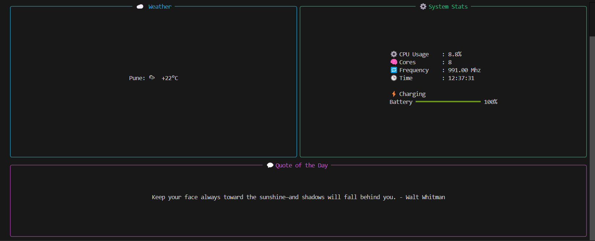

# 📊 Terminal Dashboard

A sleek, real-time terminal dashboard built with Python and **[Rich](https://github.com/Textualize/rich)**.  
It surfaces live weather, system stats, and motivational quotes—all rendered with colorful panels, emojis, and ASCII flair.



---

## ✨ Features
| Widget | What it shows |
| ------ | ------------- |
| ☁️ **Weather** | Current conditions for your city via [wttr.in](https://wttr.in) |
| ⚙️ **System Stats** | CPU usage / cores / frequency + live clock |
| 🔋 **Battery Stats** | battery percentage / charging status |
| 💬 **Quote** | Rotating inspirational quote on each refresh |
| 🛠 **Modular Design** | Drop new widgets into `widgets/` and they “just work” |

---

## 🚀 Quick Start
```bash
# clone & enter
git clone https://github.com/<your-user>/terminal_dashboard.git
cd terminal_dashboard
`
# install deps
pip install -r requirements.txt

# run!
python main.py
```

---

## 📂 Project Layout

```
terminal_dashboard/
├── main.py                 ← entry-point CLI
├── widgets/                ← self-contained widget modules
│   ├── weather.py
│   ├── system_stats.py
│   └── quote.py
├── requirements.txt
└── README.md
```

---

## 🧩 Extending

* **Network speed / ping** → hook into `speedtest-cli` or `ping` subprocess
* **GitHub activity** → call the REST API for notifications & stars
* **Full TUI** → migrate to **[Textual](https://github.com/Textualize/textual)** for mouse/keyboard interaction

Pull requests and ideas are welcome!

---

## ⚖️ License

MIT ― do what you love, credit where due.
Made with 💻 and ☕ in Pune.
